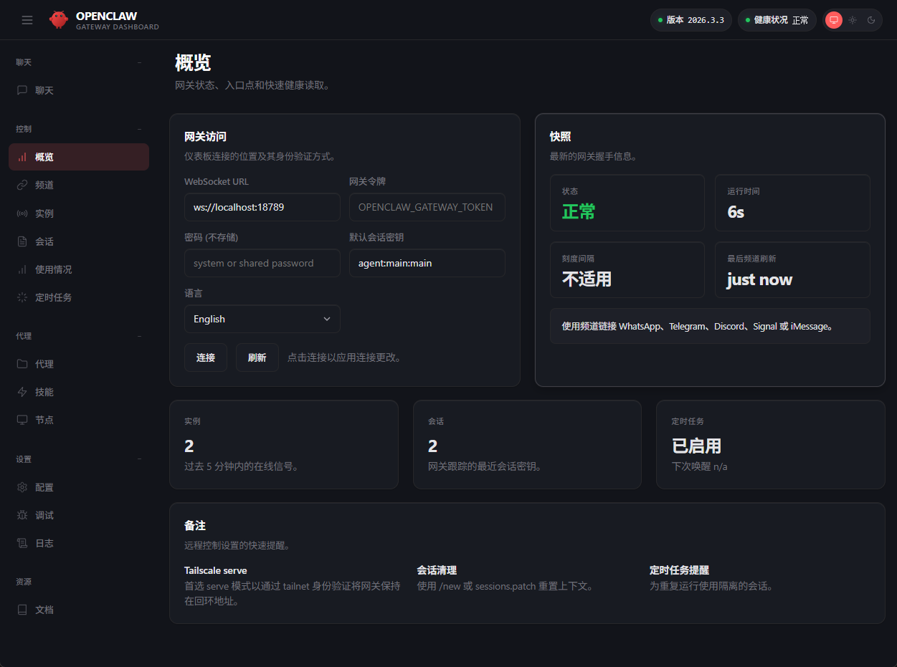
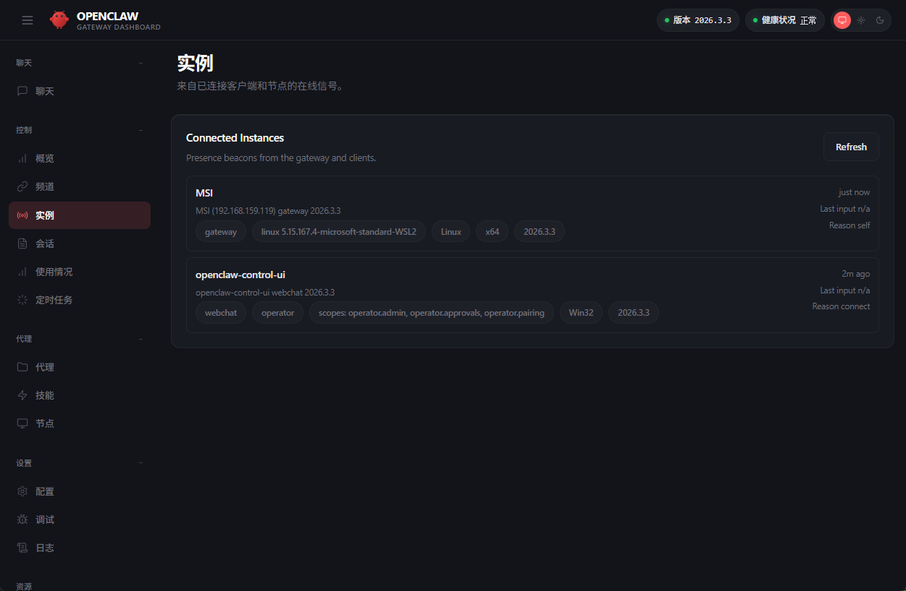
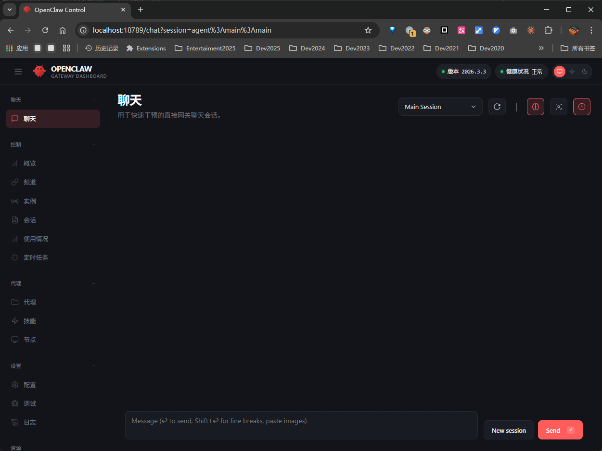

# OpenClaw Docker 部署指南

## 环境

- WSL2 Ubuntu
- Docker（snap 版：`sudo snap install docker`）
- Node.js >= 22
- Gemini CLI（`sudo npm install -g @google/gemini-cli`）

## 前置：Docker 权限修复（snap 版专属）

snap 版 Docker 默认没有 docker 组，需要手动创建并授权：

```bash
# 创建 docker 组并加入当前用户
sudo addgroup --system docker
sudo adduser $USER docker
newgrp docker

# 重启 dockerd
sudo snap restart docker

# snap 版重启后 socket 权限可能还是 root:root，手动修复
sudo chown root:docker /var/run/docker.sock
```

验证：`docker ps` 不报权限错误即可。

> **注意**：`newgrp docker` 只在当前 shell session 生效。新开终端窗口后如果又报权限错误，需要重新 `newgrp docker` 或再次 `sudo chown root:docker /var/run/docker.sock`。

## 部署 OpenClaw

```bash
# 克隆仓库
git clone https://github.com/openclaw/openclaw.git
cd openclaw

# 一键构建 + 配置 + 启动
bash docker-setup.sh
```

`docker-setup.sh` 会自动完成：
1. 构建 Docker 镜像（`openclaw:local`）—— 首次构建较慢，需要下载 Node.js 基础镜像、pnpm 安装依赖（26万行 TypeScript 项目，依赖多）、编译 TypeScript、以及 Playwright/Chromium（browser sandbox）。后续构建有缓存会快很多
2. 运行 onboarding 引导（交互式配置，详见下文）
3. 生成 gateway token
4. docker-compose 启动两个服务：
   - **openclaw-gateway** — 网关 + Web UI（端口 18789）
   - **openclaw-cli** — 命令行交互

配置目录挂载：
- `~/.openclaw/` — 配置、记忆、API keys
- `~/openclaw/workspace/` — agent 工作区（文件沙箱）

## Onboarding 引导流程

### 1. 模式选择

选 **QuickStart**，细节后面通过 `openclaw configure` 随时改。

### 2. Model/Auth Provider

选 **Google**（Gemini）。OAuth 登录走订阅额度，API key 按 token 计费。

> 注意：容器里没有宿主机的 gemini-cli，OAuth 会失败。先 Skip，跑起来后手动配置 auth（见下文）。

### 3. 模型选择

Filter 选 **google-gemini-cli**，模型选 **gemini-3-flash-preview**（或 gemini-2.5-flash 求稳）。

### 4. 聊天渠道

推荐 **Telegram (Bot API)**，配置最简单：

1. 打开 Telegram，搜索 **@BotFather**
2. 发送 `/newbot`，按提示起名
3. 获得 token（格式：`123456789:ABCdefGHI-jklMNOpqrsTUVwxyz`）
4. 粘贴到 onboarding 提示框

> 中国手机号注册 Telegram 可能收不到验证码，需要通过第三方接码服务（约 43 台币 ≈ 10 元人民币）。

不想配渠道的话选 **Skip for now**，Web UI 也能用。

### 5. 其余选项

Skills、API keys（Google Places / Gemini API / Notion 等）、Hooks 全部 **Skip for now**。后续按需配置。

## 启动后修复

### 问题 1：Gateway 启动失败 — controlUi allowedOrigins

docker-compose 里 `--bind lan` 导致非 loopback 绑定需要配置 allowedOrigins。

修复：在 `~/.openclaw/openclaw.json` 的 `gateway` 段加入：

```json
"controlUi": {
  "dangerouslyAllowHostHeaderOriginFallback": true
}
```

### 问题 2：容器无法访问外网（代理）

WSL2 的代理（如 Clash Verge）跑在 Windows 上，容器默认网络隔离访问不到。

修复：`docker-compose.yml` 改为 `network_mode: host`，并传入代理环境变量。同时 `--bind` 改为 `loopback`。详见本仓库的 docker-compose.yml。

### 问题 3：Telegram 配对

首次在 Telegram 给 bot 发消息，bot 会回复 pairing code。需要执行：

```bash
docker exec -it openclaw-openclaw-gateway-1 node dist/index.js pairing approve telegram <PAIRING_CODE>
```

## 手动配置 Gemini OAuth（核心坑）

`openclaw configure` 的交互式 OAuth 流程在 Docker + WSL2 + 代理环境下基本跑不通（终端截断 URL、OAuth 回调 localhost 不通等）。**直接手动构造 auth-profiles.json 才是正解。**

### 步骤

1. **从宿主机的 gemini-cli 提取 OAuth client credentials：**

```bash
# Client ID
grep -oP '\d+-[a-z0-9]+\.apps\.googleusercontent\.com' \
  /usr/lib/node_modules/@google/gemini-cli/node_modules/@google/gemini-cli-core/dist/src/code_assist/oauth2.js

# Client Secret
grep -oP 'GOCSPX-[A-Za-z0-9_-]+' \
  /usr/lib/node_modules/@google/gemini-cli/node_modules/@google/gemini-cli-core/dist/src/code_assist/oauth2.js
```

2. **从宿主机的 gemini-cli 获取 refresh_token：**

```bash
cat ~/.gemini/oauth_creds.json | python3 -c "import sys,json; print(json.load(sys.stdin)['refresh_token'])"
```

3. **用 refresh_token 换取 access_token：**

```bash
curl -s -X POST https://oauth2.googleapis.com/token \
  -d "client_id=<CLIENT_ID>" \
  -d "client_secret=<CLIENT_SECRET>" \
  -d "refresh_token=<REFRESH_TOKEN>" \
  -d "grant_type=refresh_token"
```

4. **用 access_token 获取 projectId：**

```bash
curl -s -X POST "https://cloudcode-pa.googleapis.com/v1internal:loadCodeAssist" \
  -H "Authorization: Bearer <ACCESS_TOKEN>" \
  -H "Content-Type: application/json" \
  -H 'Client-Metadata: {"ideType":"ANTIGRAVITY","platform":"PLATFORM_UNSPECIFIED","pluginType":"GEMINI"}' \
  -d '{"metadata":{"ideType":"ANTIGRAVITY","platform":"PLATFORM_UNSPECIFIED","pluginType":"GEMINI"}}'
```

返回的 `cloudaicompanionProject` 就是 projectId。

5. **构造 auth-profiles.json：**

写入 `~/.openclaw/auth-profiles.json` 和 `~/.openclaw/agents/main/agent/auth-profiles.json`：

```json
{
  "version": 1,
  "profiles": {
    "google-gemini-cli": {
      "type": "oauth",
      "provider": "google-gemini-cli",
      "access": "<ACCESS_TOKEN>",
      "refresh": "<REFRESH_TOKEN>",
      "expires": <EXPIRES_TIMESTAMP_MS>,
      "projectId": "<PROJECT_ID>",
      "email": "<GMAIL>",
      "clientId": "<CLIENT_ID>"
    }
  }
}
```

6. **在 docker-compose.yml 中设置环境变量**（让 token 刷新也能工作）：

```yaml
GEMINI_CLI_OAUTH_CLIENT_ID: "<CLIENT_ID>"
GEMINI_CLI_OAUTH_CLIENT_SECRET: "<CLIENT_SECRET>"
```

7. **重启容器：**

```bash
docker compose down && docker compose up -d
```

## docker-compose.yml 关键改动

相比官方原版，本部署做了以下修改：

1. **`network_mode: host`** — 容器直接使用 WSL 网络栈，解决代理和端口转发问题
2. **代理环境变量** — `http_proxy`、`https_proxy`、`all_proxy`、`no_proxy` 传入容器
3. **`--bind loopback`** — host 网络模式下绑定 loopback
4. **`~/.gemini` 挂载** — 宿主机 gemini-cli OAuth token 目录映射到容器
5. **Gemini OAuth client credentials** — 通过环境变量注入，免去容器内安装 gemini-cli

## 凭据

- **Telegram Bot**: @seth_de_openclaw_bot
- **Telegram Bot Token**: `8716608157:AAFHEn8f4p-G4z0vfaME2BWOaAwiq3FYM4Y`
- **Gateway Token**: `9733b58bbcac5cc94247e2647ae3e6b6212073bdb167709e704c5242f845639b`
- **Gemini OAuth Client ID**: （从 gemini-cli 源码提取，见上文步骤）
- **Gemini OAuth Client Secret**: （从 gemini-cli 源码提取，见上文步骤）
- **Google Cloud Project**: （从 loadCodeAssist API 获取，见上文步骤）

## 访问

- Web UI: http://localhost:18789（需要 gateway token 认证）
- Telegram: 直接给 @seth_de_openclaw_bot 发消息

## 界面截图

### 概览仪表盘

网关状态、连接信息、快照一览。



### 连接实例

已连接的客户端和节点信号。



### 聊天界面

直接在 Web UI 里和 agent 对话。



## 常见问题

### Web UI 被锁定（too many failed authentication attempts）

Web UI 有内存级限流，10 次失败后锁定 5 分钟。但浏览器会自动重连不断触发，导致永远解不了锁。

解法：
1. **关掉所有浏览器标签页**
2. 临时改 `~/.openclaw/openclaw.json` 中 `gateway.auth.mode` 为 `"none"`
3. `docker compose down && docker compose up -d`
4. 无痕模式打开 Web UI，进去后再改回 `"token"` 模式

> 注意：loopback 地址（127.0.0.1）本来是免限流的，但 Windows 浏览器通过 portproxy 访问 WSL 的 IP 不是 loopback，所以会被限流。
